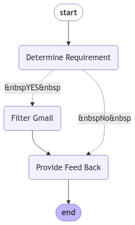

# Gmail Assistant

## Description

This project aims to enhance the efficiency of Gmail usage by utilizing LangGraph to create an intelligent agent that assists users with their daily inquiries related to Gmail. The agent can analyze user requirements, transform them into Gmail search syntax, and retrieve relevant emails based on specified criteria.

## Features

- The agent can determine if a user's request is related to Gmail and provide appropriate responses or suggestions.
- It can filter Gmail inboxes based on various parameters such as sender, recipient, subject, body content, attachments, and date ranges.

## Architecture

The project is structured around a workflow that integrates user input with a language model to provide responses. The main components include:

- **LangGraph**: For building agent workflow.
- **OpenAI GPT-4**: For generating responses based on user input.

## System Overview



### Agent Workflow

The agent follows this basic workflow:
1. **Input Analysis**: Analyzing user queries to determine intent
2. **Query Formation**: Converting natural language into Gmail search syntax
3. **Email Retrieval**: Fetching relevant emails from Gmail
4. **Response Generation**: Providing useful information back to the user

## How to Run

### Prerequisites

- Python 3.10 or later
- OpenAI API key
- Google API key
- Gmail API credentials
- Python libraries (see requirements.txt)

### Set up

1. Clone the repository:

   ```bash
   git clone https://github.com/Haemon-Yang/Gmail-Assistant.git
   ```

2. Navigate to the project directory:

   ```bash
   cd Gmail-Assistant
   ```

3. Install the required dependencies:

   ```bash
   pip install -r requirements.txt
   ```

4. Set up your environment variables by creating a `.env` file and adding the necessary keys.

   ```env
   OPENAI_API_KEY = your_openai_api_key
   LANGCHAIN_API_KEY = your_langchain_api_key
   TAVILY_API_KEY = your_tavily_api_key
   ```

5. Set up Gmail API credentials:

   Follow [this guide](https://developers.google.com/gmail/api/quickstart/python) to set up Gmail API credentials.

   **Important Note About Credentials:**
   - You need to generate a `credentials.json` file from the Google Cloud Console.
   - When you first run the application, it will use these credentials to generate a `token.json` file.
   - The `token.json` file contains OAuth 2.0 access tokens that expire periodically (typically after 1 hour).
   - Refresh tokens in `token.json` may also expire if:
     - The user revokes access
     - The tokens haven't been used for an extended period
     - You've reached Google's security limits
   - If authentication fails, you may need to delete the `token.json` file and re-authenticate.

6. Run the application:

   ```bash
   python main.py
   ```

## Running Gmail-Assistant with Docker

To build and run the project using Docker, follow these steps:

1. Build Docker Image:

   ```bash
   docker build -t gmail-assistant .
   ```

2. Run Docker Container:

   ```bash
   docker run -it --name container_name --env-file .env -p 5000:5000 gmail-assistant
   ```

## Contributing

Contributions are welcome! Please feel free to submit a pull request or open an issue for any suggestions or improvements.

## License

This project is licensed under the MIT License.
